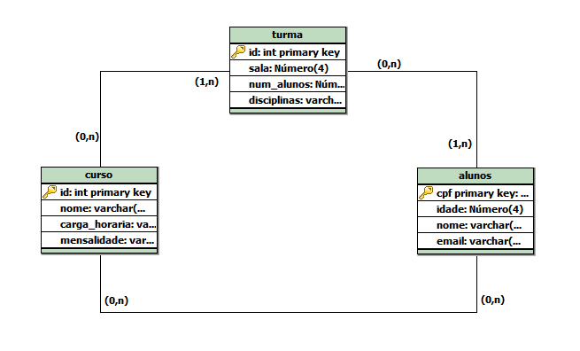

# 
Sistema Resilia

## 📌 Objetivo: 

- O projeto deste módulo consistiu em criar um banco de dados (**escola**) que contivesse três entidades/tabelas (**cursos, turmas e alunos**).

### ⇨ Existem outras entidades além dessas três?
>Não, porém poderiam ter.

### ⇨ Quais são os principais campos e tipos?
> Os principais campos são id e cpf, porque são as chaves primárias. Os tipos estão definidos como int e varchar.

### ⇨ Como essas entidades estão relacionadas?
>A entidade turma possui no mínimo '1' e no máximo 'N' cursos. Cursos pode estar em '0' ou 'N' turmas; 
>Uma turma pode ter '0' ou no máximo 'N' aluno. Aluno pode estar no minimo '1' e máximo 'N' turmas; 
>Um aluno pode estar em '0' ou 'N' cursos. Cursos pode ter '0' ou 'N' alunos. 

## Registros cadastrados no sistema: 

INSERT INTO `alunos` (`cpf`, `idade`, `nome`, `email`) VALUES 
('125.694.305-3', 27, 'joao da silva', 'joaodasilva@gmail.com'), 
('136.834.102-9', 38, 'maria da silva', 'mariadasilva@gmail.com');

INSERT INTO `curso` (`id`, `nome`, `carga_horaria`, `mensalidade`) VALUES 
(1, 'bartender', '250hrs', 'R$ 255.00'), 
(2, 'ingles', '300hrs', 'R$ 155.00');

INSERT INTO `turma` (`id`, `sala`, `num_alunos`, `disciplinas`) VALUES 
(1, 12, 30, '10'), 
(2, 15, 26, '12');

